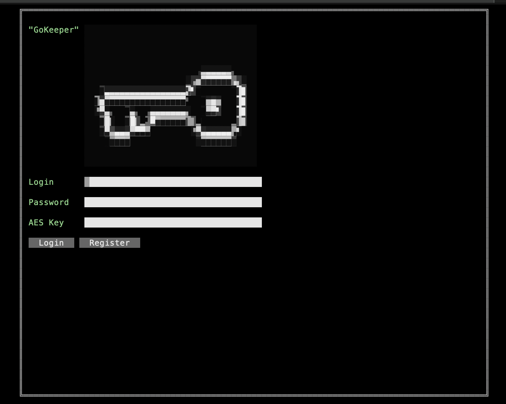
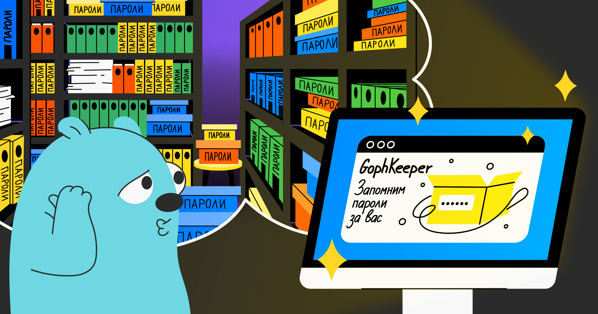

# gophKeeper

## Описание приложения
Менеджер паролей "GophKeeper" - клиент-серверное приложение, предназначенное для хранения паролей, текста, учетных данных кредитных карт и бинарных файлов, работающее по протоколу gRPC в режиме защищенного соединения SSL/TLS (server-side TLS, not mutual).
 

### Клиент 
Клиент представляет собой приложение, реализованное с помощью terminal user interface (TUI) библиотеки "tview". Клиент позволяет подключаться к серверу, получать список хранимой в БД информации, осуществлять RPC-запросы (авторизация, регистрация, список хранимой информации, создание, чтение, удаление записей из БД). При отправке и получении записей все данные шифруются и дешифруются соответственно при помощи симметричного алгоритма шифрования AES-256 в режиме CBC с длиной ключа 32 байта (AES-ключ указывается при авторизации и может изменяться из главного меню программы для доступа к информации, созданной ранее). Для удобства использования в клиенте предусмотрено отображение подсказки для AES-ключа (password hint). Кроме того на главной странице отображается meta-информация (согласно ТЗ). Terminal User Interface реализован таким образом, чтобы переход к различным страницам был логически связан и удобен.Переходы осуществляются при помощи нажатий различных комбинаций клавиш Ctrl+N - создать запись, Ctrl+D - удалить запись, Ctrl+K - изменить ключ шифрования, ESC - выход в предыдущее меню/logout и т.д. Клиент ведет логи и пишет их в файл 2006-01-02.log.
 

#### Параметры запуска клиента:
Usage of /var/folders/97/djh8xprn2xjdd5b59z_2zmxm0000gn/T/go-build4094180697/b001/exe/main:
  -addr string
    	Server address and port (default "127.0.0.1:9000")
  -clientcert string
    	Path to client certificat for TLS (default "../../cmd/cert/ca-cert.pem")
 

### Сервер
Сервер представляет собой приложение, обрабатывающее gRPC-запросы и предоставляющее доступ к БД (Postgres) или к файлам. Все данные на стороне сервера (данные в БД или файлы в директории) хранятся в зашифрованном виде, при помощи криптографического симметричного алгоритма шифрования AES-256-CBC. На сервере реализован interceptor, осуществляющий аутентификацию пользователя через механизм токенов JWT-authentication token (время жизни токена - настраивамый параметр). Также реализован interceptor логирующий весь запрос от клиента. Сервер ведет логи и пишет их в файл 2006-01-02.log. В зависимости от состояния булевой переменной (в конфиге) - перехваченные на interceptor запрос req и метаданные MD выводятся в stdout терминала.   
 

#### Параметры запуска сервера:
Usage of /var/folders/97/djh8xprn2xjdd5b59z_2zmxm0000gn/T/go-build3862893827/b001/exe/main:
  -dsn string
    	Source to DB (default "user=postgres password=mypassword host=localhost port=5432 dbname=gokeeper sslmode=disable")
  -exptime duration
    	Token expiration time (default 2m0s)
  -filepath string
    	Path to files store (default "data")
  -jwtsecr string
    	JWT secret (default "mySuperSecretKey")
  -listenaddr string
    	Server address and port (default "127.0.0.1:9000")
  -servcert string
    	Path to server certificat for TLS (default "../../cmd/cert/server-cert.pem")
  -servconslog
    	Console log request and MD data on server interceptors (default true)
  -servkey string
    	Path to server key for TLS (default "../../cmd/cert/server-key.pem")
 

Передача данных между клиентом и сервером происходит в режиме защищенного соединения SSL/TLS (server-side TLS, not mutual). Для этого перед запуском программ неоходимо сгенерировать сертификаты и ключи при помощи команды "make cert" (см. содержимое файла Makefile). 
> ВНИМАНИЕ: Для успешной работы на localhost необходима опция -extfile server-ext.conf (см. файл cert/gen.sh) в котором будет указан SAN-параметр.
 

### Makefile
Для удобства реализован Makefile, позволяющий:
- сгенерировать сертификаты для TLS;
- выполнить сборку модулей;
- добавить BUILD FLAGS при сборке модулей (buildVersion, buildDate, buildCommit);
- выполнить очистку бинарных модулей;
- запустить тесты во всех директориях;
- подсчитать покрытие кода юниттестами.

### Техническое задание
Менеджер паролей GophKeeper

### Общие требования
GophKeeper представляет собой клиент-серверную систему, позволяющую пользователю надёжно и безопасно хранить логины, пароли, бинарные данные и прочую приватную информацию.

Сервер должен реализовывать следующую бизнес-логику:
- регистрация, аутентификация и авторизация пользователей;
- хранение приватных данных;
- синхронизация данных между несколькими авторизованными клиентами одного владельца;
- передача приватных данных владельцу по запросу.

Клиент должен реализовывать следующую бизнес-логику:
- аутентификация и авторизация пользователей на удалённом сервере;
- доступ к приватным данным по запросу.

Функции, реализация которых остаётся на усмотрение исполнителя:
- создание, редактирование и удаление данных на стороне сервера или клиента;
- формат регистрации нового пользователя;
- выбор хранилища и формат хранения данных;
- обеспечение безопасности передачи и хранения данных;
- протокол взаимодействия клиента и сервера;
- механизмы аутентификации пользователя и авторизации доступа к информации.

Дополнительные требования:
- клиент должен распространяться в виде CLI-приложения с возможностью запуска на платформах Windows, Linux и Mac OS;
- клиент должен давать пользователю возможность получить информацию о версии и дате сборки бинарного файла клиента.

Типы хранимой информации
- пары логин/пароль;
- произвольные текстовые данные;
- произвольные бинарные данные;
- данные банковских карт.

Для любых данных должна быть возможность хранения произвольной текстовой метаинформации (принадлежность данных к веб-сайту, личности или банку, списки одноразовых кодов активации и прочее).

### Абстрактная схема взаимодействия с системой

Ниже описаны базовые сценарии взаимодействия пользователя с системой. Они не являются исчерпывающими — решение отдельных сценариев (например, разрешение конфликтов данных на сервере) остаётся на усмотрение исполнителя.

Для нового пользователя:
- Пользователь получает клиент под необходимую ему платформу.
- Пользователь проходит процедуру первичной регистрации.
- Пользователь добавляет в клиент новые данные.
- Клиент синхронизирует данные с сервером.

Для существующего пользователя:
- Пользователь получает клиент под необходимую ему платформу.
- Пользователь проходит процедуру аутентификации.
- Клиент синхронизирует данные с сервером.
- Пользователь запрашивает данные.
- Клиент отображает данные для пользователя.

Тестирование и документация
Код всей системы должен быть покрыт юнит-тестами не менее чем на 80%. Каждая экспортированная функция, тип, переменная, а также пакет системы должны содержать исчерпывающую документацию.

Необязательные функции
Перечисленные ниже функции необязательны к имплементации, однако позволяют лучше оценить степень экспертизы исполнителя. Исполнитель может реализовать любое количество из представленных ниже функций на свой выбор:
- поддержка данных типа OTP (one time password);
- поддержка терминального интерфейса (TUI — terminal user interface);
- использование бинарного протокола;
- наличие функциональных и/или интеграционных тестов;
- описание протокола взаимодействия клиента и сервера в формате Swagger.